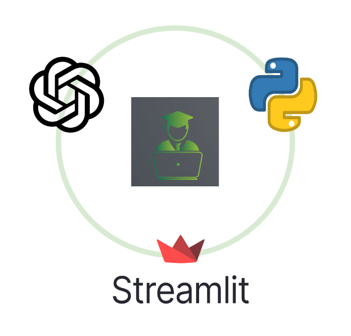
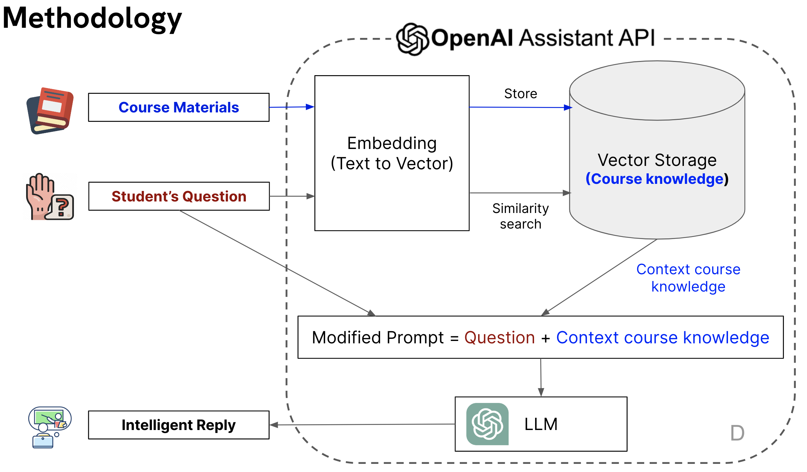
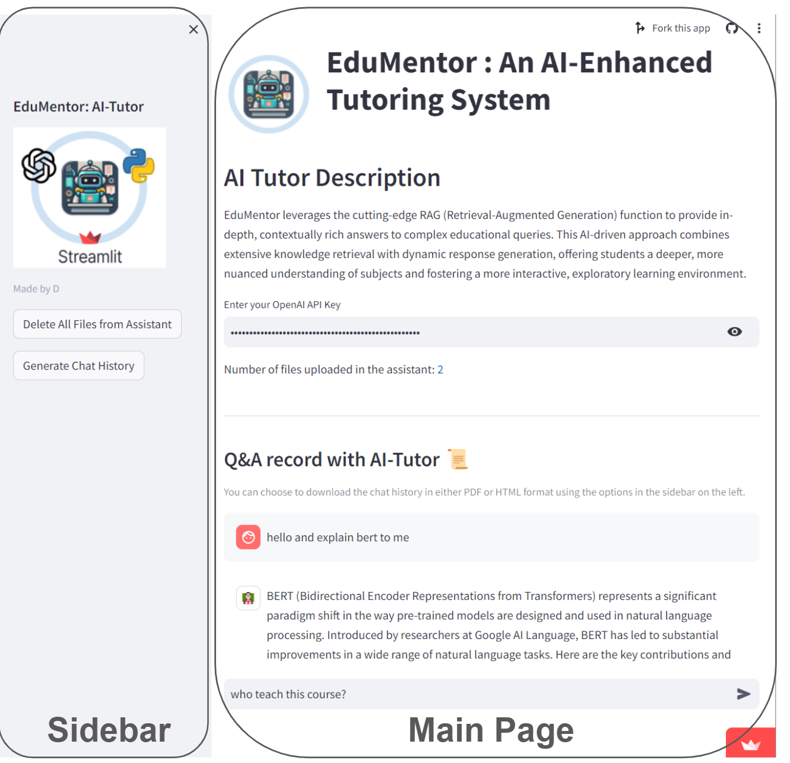

# AI-Tutor: Customized AI Tutoring for Diverse Academic Courses

    

## Overview
AI-Tutor, an educational web app, integrates the latest OpenAI's Assistant API and Retrieval-Augmented Generation (RAG) to offer personalized tutoring across various academic courses. It adapts to specific course materials, ensuring a dynamic, responsive, and tailored learning experience.

## Core Features
- **Versatile Application**: Adaptable to any course with the requirement of uploading course-specific materials.
- **Intelligent Tutoring**: Tailored responses that align with course content, overcoming information hallucination.
- **User Interface**: Streamlit-based, intuitive UI hosted on the Free Streamlit Community Cloud.
- **Data Privacy and Security**: Adherence to OpenAI's stringent privacy practices.

## Technical Composition
- **Core Technologies**: Utilizes LLM and RAG from OpenAI's Assistants API for core AI functionalities.
- **Programming Language**: Primarily Python.
- **Hosting Server**: Free Streamlit Community Cloud.

## Methodology
AI-Tutor employs a combination of advanced AI technologies to enhance the learning experience:

- **LLM API**: This forms the backbone of AI-Tutor's intelligence. It enables the platform to understand complex queries, retrieve information efficiently, and provide accurate, context-aware responses.

- **Retrieval-Augmented Generation (RAG)**: RAG is a key component that supplements the AI's knowledge base. By accessing external data sources, RAG ensures that the AI's responses are not only relevant but also grounded in verified information. This feature is crucial for maintaining the accuracy and reliability of the educational content provided by AI-Tutor.

  - *Mitigating Information Hallucination*: RAG effectively addresses the challenge of AI-generated misinformation by validating responses against trusted external sources.
  - *Personalized Learning Experience*: The use of diverse data sources enables AI-Tutor to tailor its responses to specific educational contexts and individual learner needs.

## Web App Components

    

- **Sidebar**: 
  - Option to delete all uploaded materials.
  - Generate and download Q&A records in HTML format.
- **Main Page**: 
  - API Key input.
  - Upload feature for course materials.
  - Interactive Q&A section.
  - Display and archive of Q&A records.
  - Feature to pose new questions.

## Getting Started
1. Access [AI-Tutor Streamlit App](https://aitutor-gawywv3h6qfwzzvikfzkpl.streamlit.app/).
2. Enter your OpenAI API Key.
3. Upload course materials for a custom tutoring session.
4. Interact with the AI assistant for course-specific queries.
5. Download the Q&A session transcript in HTML format.

## Benefits
- **Enhanced Learning Experience**: Integrates RAG with AI technologies for a personalized educational journey.
- **Data Privacy Assurance**: Strong commitment to user data protection.
- **Current and Relevant Responses**: Ensures up-to-date and accurate information.
- **Broad Course Coverage**: Applicable across various educational fields and disciplines.
- **Interactive Tutoring**: Real-time feedback and dynamic learning sessions.

## References
- [OpenAI Assistant API Documentation](https://platform.openai.com/docs/guides/assistants)
- [Introduction to Retrieval-Augmented Generation (RAG)](https://www.datastax.com/blog/2020/10/introducing-retrieval-augmented-generation-rag)
- [Vector Database Similarity Search](https://www.infoworld.com/article/3634357/what-is-vector-search-better-search-through-ai.html)
- [OpenAI Privacy and Security Practices](https://openai.com/security)
